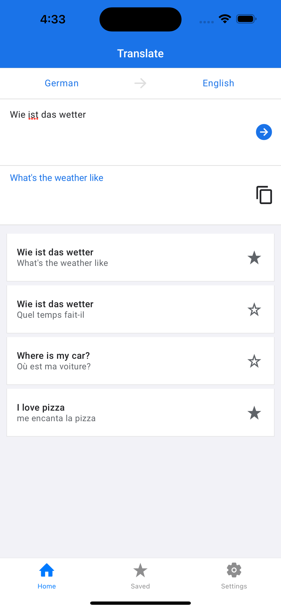
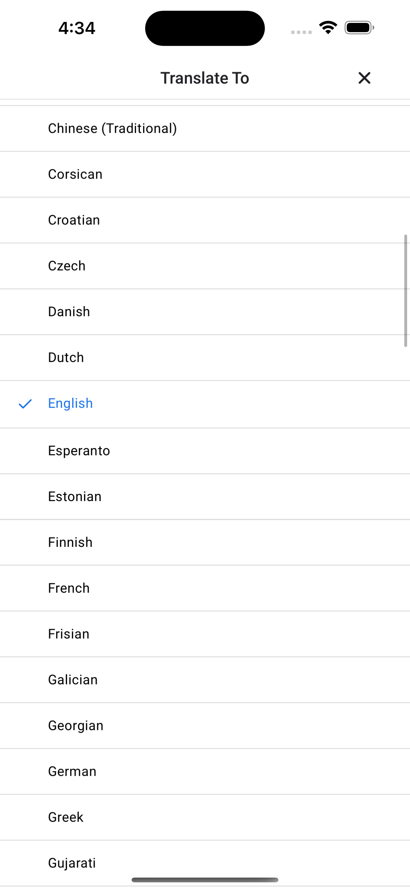
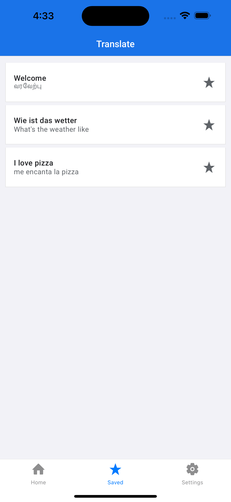
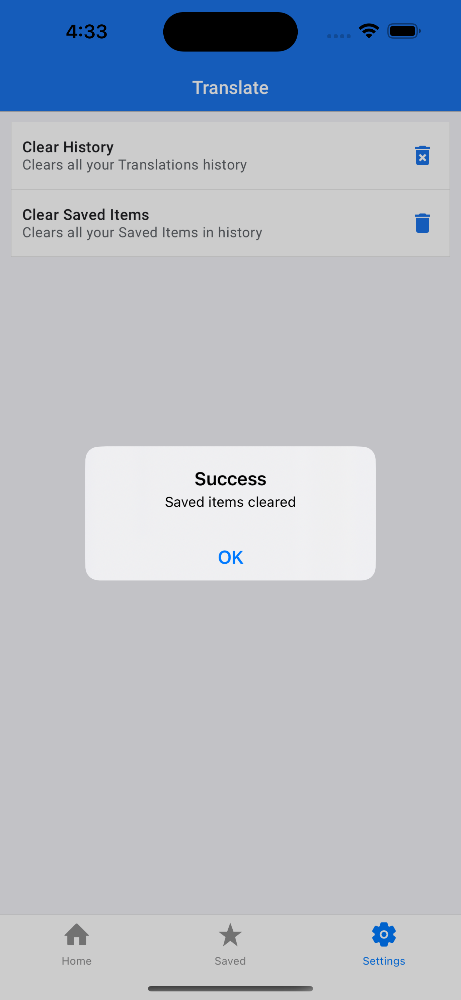

# Translate

### A Google Translation app clone in React Native

Translate is a translation app with 100+ languages from and to translate. I have used an **NLP translate API** from [rapidapi.com](https://rapidapi.com/gofitech/api/nlp-translation/)

 
 

## Features

-   100+ languages
-   Stores Translated sentences in history
-   Stored saved translated sentences in saved history
-   Clearn history and saved history

## Installation

React Native requires [Node.js](https://nodejs.org/) v10+ to run.
To see the output, use Virtual devices like [Xcode](https://developer.apple.com/xcode/) Simulator or use physical device with [Expo](https://apps.apple.com/app/apple-store/id982107779) app installed

Install the dependencies and start the server.

```sh
git clone https://github.com/a-loke/translator.git
cd translate
npm install
npm start
```

Scan the QR code on physical device or press `a` or `i` to open in Android or IOS simulator respectively
